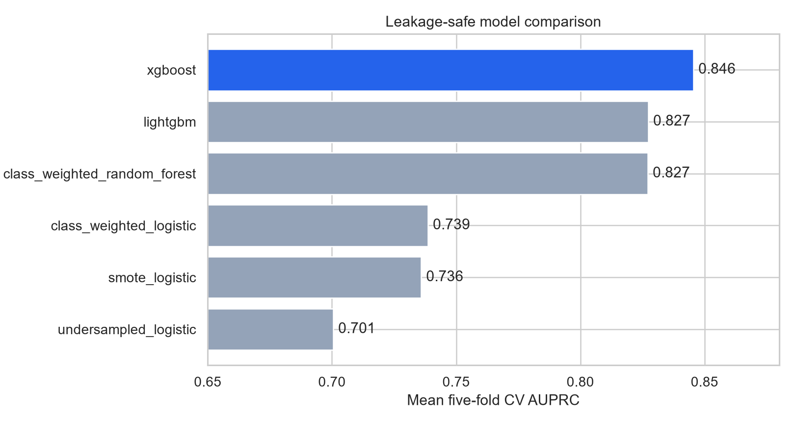
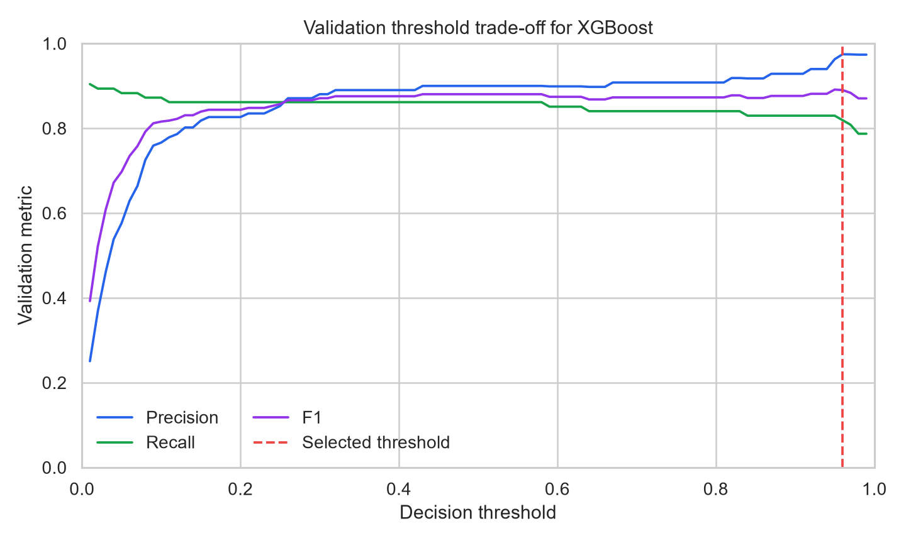
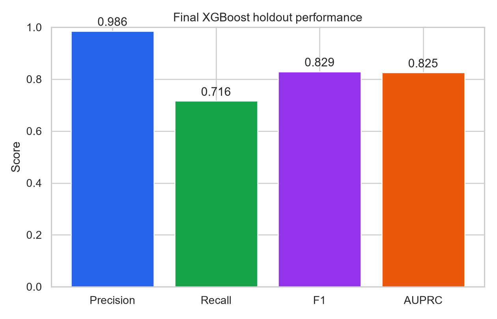
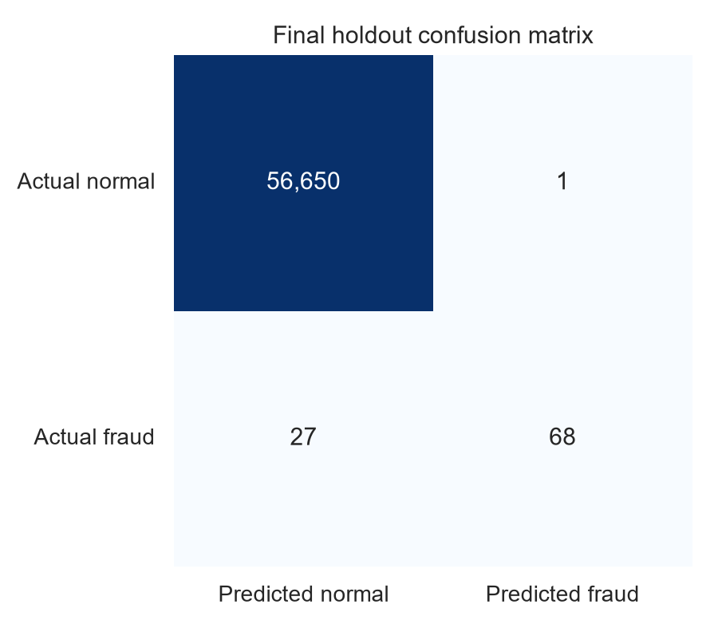

<div align="center">

# Credit Card Fraud Detection

### Imbalanced Classification • Fraud Analytics • Threshold Optimization

<p>
  
  
  
  
</p>

<p>
A leakage-aware machine-learning study of extreme credit-card fraud imbalance,
from exploratory analysis and resampling experiments to cross-validated model
selection and threshold-optimized final evaluation.
</p>

**XGBoost achieved 0.8253 holdout AUPRC and 98.55% precision, with only one false positive.**

</div>

---

## Project at a Glance

| | |
|---|---|
| **Goal** | Detect rare fraudulent credit-card transactions |
| **Raw Dataset** | 284,807 transactions |
| **Raw Fraud Cases** | 492 |
| **Fraud Rate** | 0.1727% |
| **Modeling Dataset** | 283,726 unique transactions after deduplication |
| **Models Compared** | 6 |
| **Selection Metric** | 5-fold CV AUPRC |
| **Selected Model** | XGBoost |
| **Final Threshold** | 0.9598 |
| **Test AUPRC** | **0.8253** |
| **Test Precision** | **98.55%** |
| **Test Recall** | **71.58%** |

> **Headline finding:** balancing the training data more aggressively did not produce the strongest model. Gradient boosting on the original imbalanced distribution outperformed SMOTE and random undersampling baselines.

---

## Navigation

<p align="center">
  <a href="#dataset">Dataset</a> •
  <a href="#preprocessing">Preprocessing</a> •
  <a href="#imbalance-handling">Imbalance</a> •
  <a href="#model-comparison">Models</a> •
  <a href="#threshold-optimization">Threshold</a> •
  <a href="#final-test-result">Final Result</a> •
  <a href="#key-findings">Findings</a>
</p>

---

# Dataset

The project uses the European Credit Card Fraud Detection dataset with **284,807 transactions and 31 numerical columns**.

| Variable | Description |
|---|---|
| `Time` | Seconds elapsed from the first recorded transaction |
| `V1–V28` | PCA-transformed anonymized transaction features |
| `Amount` | Transaction amount |
| `Class` | `0` legitimate, `1` fraud |

### Raw Data Summary

| Statistic | Value |
|---|---:|
| Transactions | **284,807** |
| Legitimate | **284,315** |
| Fraud | **492** |
| Fraud Rate | **0.1727%** |
| Missing Values | **0** |
| Duplicate Rows | **1,081** |

Fraud represents roughly **1 in every 578 transactions**, making accuracy a poor primary metric.

---

# Preprocessing

## Leakage-Safe Experimental Design

The pipeline separates model development from final evaluation:

<div align="center">

**Raw Data**

↓

**Remove Duplicates**

↓

**Stratified 60 / 20 / 20 Split**

↓

**Fit Preprocessing Inside Training / CV Folds**

↓

**Model Selection on Training CV**

↓

**Threshold Selection on Validation**

↓

**Final Test Evaluation Once**

</div>

After removing duplicates, the modeling dataset contains **283,726 unique transactions** and **473 fraud observations**.

| Split | Legitimate | Fraud | Fraud Rate |
|---|---:|---:|---:|
| Training | 169,951 | 284 | 0.1668% |
| Validation | 56,651 | 94 | 0.1657% |
| Test | 56,651 | 95 | 0.1674% |

`Time` and `Amount` are transformed using **RobustScaler**.

For cross-validation, the scaler is part of the estimator pipeline so it is fitted independently inside each CV training fold.

`V1–V28` are passed through unchanged because they are already PCA-transformed variables.

---

# Imbalance Handling

The project compares multiple ways of handling the rare fraud class rather than assuming that one balancing technique is always superior.

### Original / Class-Weighted Learning

Preserves the real training distribution and modifies the model loss through class weights.

### SMOTE

**Synthetic Minority Over-sampling Technique** generates synthetic minority observations between nearby fraud samples.

SMOTE is applied **inside the cross-validation pipeline**, ensuring that synthetic observations are created only from each training fold.

### Random Undersampling

Random undersampling reduces the majority class inside each training fold.

This improves class balance but discards a substantial amount of legitimate-transaction information.

### Gradient Boosting

XGBoost and LightGBM model the original imbalanced training data using imbalance-aware weighting rather than forcing an artificially balanced dataset.

---

# Model Comparison

Six candidate strategies are compared under the same **5-fold Stratified Cross-Validation** protocol.

| Model | Recall | Precision | F1 | AUPRC |
|---|---:|---:|---:|---:|
| **XGBoost** | 0.8164 | 0.8943 | 0.8527 | **0.8455** |
| LightGBM | 0.8060 | **0.9150** | **0.8566** | 0.8273 |
| Class-Weighted Random Forest | 0.7039 | 0.9387 | 0.8036 | 0.8271 |
| Class-Weighted Logistic | **0.9044** | 0.0534 | 0.1007 | 0.7386 |
| SMOTE + Logistic | 0.8551 | 0.3761 | 0.5215 | 0.7355 |
| Undersampling + Logistic | 0.8622 | 0.2859 | 0.4284 | 0.7004 |

<p align="center">
  
</p>

## Why XGBoost?

XGBoost produced the **highest CV AUPRC and F1-score**, while maintaining a strong balance between precision and recall.

The comparison also shows why recall alone is insufficient.

The class-weighted Logistic Regression model achieved the highest recall, but its extremely low precision would generate an impractical number of false alerts.

---

# Threshold Optimization

A classifier's default probability threshold of `0.50` is not necessarily the best operating point for an imbalanced fraud-detection problem.

The XGBoost threshold was selected **using validation data only** by maximizing F1-score.

| Validation Setting | Precision | Recall | F1 |
|---|---:|---:|---:|
| Threshold 0.50 | 0.9000 | **0.8617** | 0.8804 |
| **Threshold 0.9598** | **0.9750** | 0.8298 | **0.8966** |

<p align="center">
  
</p>

The tuned threshold sacrifices a small amount of recall in exchange for higher precision and a better F1-score.

After this threshold was selected, it was **locked before the test set was evaluated**.

---

# Final Test Result

## XGBoost — Untouched Test Set

| Metric | Result |
|---|---:|
| Decision Threshold | **0.9598** |
| Precision | **98.55%** |
| Recall | **71.58%** |
| F1-score | **82.93%** |
| AUPRC | **82.53%** |
| True Positives | **68** |
| False Positives | **1** |
| False Negatives | **27** |
| True Negatives | **56,650** |

<p align="center">
  
</p>

<p align="center">
  
</p>

Out of **95 fraudulent transactions** in the test set, the model detected **68** while producing only **one false fraud alert** among 56,651 legitimate transactions.

The final operating point is therefore deliberately conservative:

> **Very high precision with a trade-off in fraud recall.**

---

# Business Interpretation

<table>
<tr>

<td width="50%" valign="top">

### False Negative

**Fraud → Legitimate**

The model missed **27 fraud cases**.

In a real payment system, these errors may correspond to direct financial loss.

</td>

<td width="50%" valign="top">

### False Positive

**Legitimate → Fraud**

The model generated only **1 false alert**.

This minimizes unnecessary investigations and customer disruption.

</td>

</tr>
</table>

The selected threshold reflects a **high-precision operating policy**.

An organization that places a higher cost on missed fraud could deliberately lower the decision threshold to improve recall while accepting more false positives.

---

# Key Findings

<table>

<tr>

<td width="50%" valign="top">

### Extreme imbalance changes the objective

Only **0.1727%** of the original transactions are fraudulent.

Headline accuracy is therefore not informative.

</td>

<td width="50%" valign="top">

### XGBoost provided the best overall CV result

It achieved the highest **AUPRC (0.8455)** across six candidate strategies.

</td>

</tr>

<tr>

<td width="50%" valign="top">

### Resampling was not automatically better

SMOTE and undersampling increased minority representation, but both Logistic baselines remained below the tree-based models in AUPRC.

</td>

<td width="50%" valign="top">

### Threshold selection matters

Changing the validation threshold from **0.50 to 0.9598** improved F1 from **0.8804 to 0.8966**.

</td>

</tr>

<tr>

<td width="50%" valign="top">

### Final predictions are highly precise

The test set produced **68 true positives and only 1 false positive**.

</td>

<td width="50%" valign="top">

### Precision comes with a recall cost

The conservative operating point still missed **27 of 95 fraud cases**, leaving room for business-driven threshold adjustment.

</td>

</tr>

</table>

---

# Methodological Notes

### Cross-Validation Preprocessing

Scaling is fitted **inside each CV training fold**, preventing preprocessing information from leaking from validation folds into model training.

### Resampling

SMOTE and RandomUnderSampler are implemented using `imblearn.pipeline.Pipeline`.

This ensures that resampling occurs independently inside each CV training fold.

### XGBoost Weighting

The current XGBoost uses:

```text
scale_pos_weight = 100
```

This is intentionally lower than the full training class ratio and is treated as a conservative imbalance weight rather than a calibrated probability adjustment.

### Probability Interpretation

Because class weighting changes the learning objective, predicted values should primarily be interpreted as **ranking/classification scores** unless probability calibration is added.

---

# Limitations

- `V1–V28` are anonymized PCA components, limiting semantic feature interpretation.
- Deduplication removes **19 fraud records**, so a with-vs-without-duplicates sensitivity analysis could strengthen the study.
- `scale_pos_weight=100` has not yet been formally optimized through cross-validation.
- Historical transaction behavior may not represent future fraud patterns.
- The selected threshold prioritizes precision and may not be appropriate when missed fraud has a much higher business cost.
- A production fraud-detection system would additionally require probability calibration, cost-sensitive thresholding, latency monitoring, and concept-drift detection.

---

# Repository Structure

```text
credit-card-fraud-detection/
├── README.md
├── plan.md
├── requirements.txt
│
├── data/
│   └── README.md
│
├── notebooks/
│   ├── 01_eda.ipynb
│   ├── 02_preprocessing.ipynb
│   ├── 03_modeling.ipynb
│   └── 04_evaluation.ipynb
│
├── src/
│   ├── data_loader.py
│   ├── preprocessing.py
│   ├── model.py
│   └── evaluation.py
│
├── tests/
│
├── figures/
│   ├── model_comparison.png
│   ├── threshold_analysis.png
│   ├── final_test_performance.png
│   └── confusion_matrix.png
│
└── results/
    ├── model_comparison.csv
    ├── threshold_analysis.csv
    └── final_test_metrics.json
```

---

<details>
<summary><b>Reproduce the Project</b></summary>

<br>

Install dependencies:

```bash
pip install -r requirements.txt
```

Place the dataset at:

```text
data/creditcard.csv
```

Run the notebooks in order:

```text
01_eda.ipynb
02_preprocessing.ipynb
03_modeling.ipynb
04_evaluation.ipynb
```

Or reproduce the published model-comparison, threshold, and holdout result without Jupyter:

```bash
python scripts/run_experiment.py
python scripts/generate_report_assets.py
```

Run the unit tests:

```bash
pytest -q
```

</details>

---

<div align="center">

### Credit Card Fraud Detection

**Imbalanced Learning • Gradient Boosting • Threshold Optimization**

</div>
